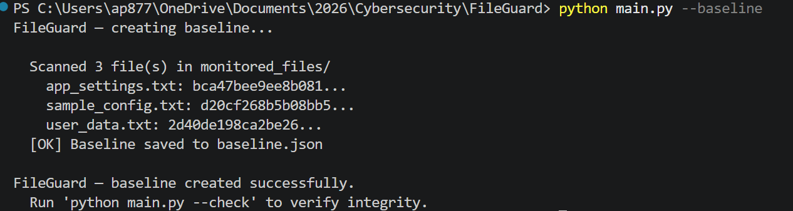
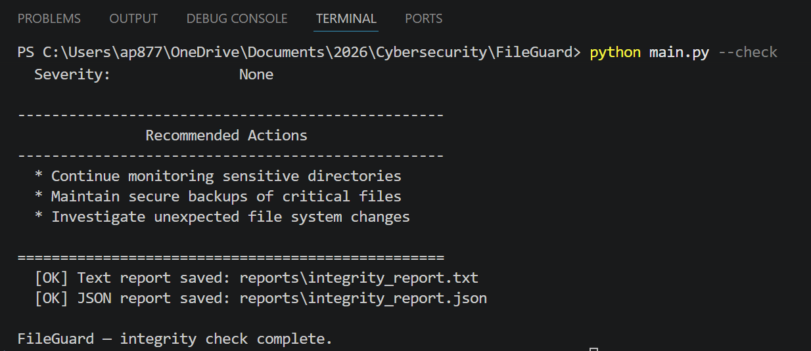
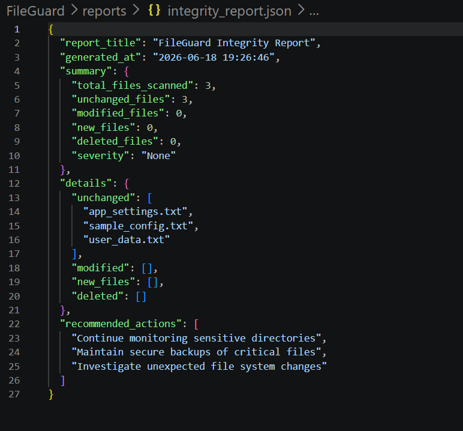
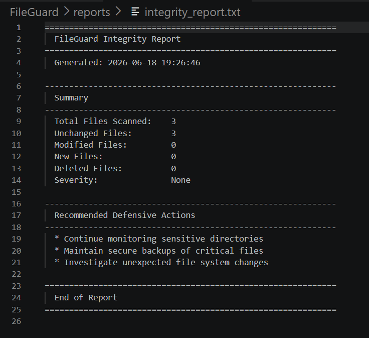

# FileGuard — File Integrity Monitoring Tool

FileGuard is a beginner-friendly **defensive cybersecurity project** that
monitors file integrity using SHA-256 hashes, detects file changes, and
generates tamper-detection reports.

> ⚠️ **Safety Note:** This project is **defensive and educational**. It
> monitors local sample files only. It does not attack, scan, or modify
> any external system.

---

## What This Project Demonstrates

| Skill Area | What You Learn |
|---|---|
| File Integrity Monitoring | Tracking whether files have changed |
| SHA-256 Hashing | Cryptographic file fingerprinting |
| Tamper Detection | Identifying unauthorized modifications |
| Baseline Comparison | Establishing and comparing known-good states |
| Digital Forensics Basics | Verifying data integrity and trust |
| Defensive Cybersecurity | Proactive detection of file system changes |
| Incident-style Reporting | Documenting findings for response |
| Python Scripting | hashlib, argparse, JSON, file I/O |

---

## How It Works

```
monitored_files/ → SHA-256 Baseline → Re-scan → Compare Hashes → Detect Changes → Report
```

1. **Baseline** — Scan `monitored_files/` and save SHA-256 hashes to `baseline.json`
2. **Check** — Re-scan the folder and compare current hashes against the baseline
3. **Detect** — Identify unchanged, modified, new, and deleted files
4. **Report** — Generate terminal output, text report, and JSON report

---

## Commands

### Create Baseline

```bash
python main.py --baseline
```

Scans `monitored_files/` and saves hash fingerprints to `baseline.json`.

### Check Integrity

```bash
python main.py --check
```

Compares current file hashes against the baseline and reports changes.

---

## Severity Logic

| Severity | Trigger |
|---|---|
| Low | Only new files detected |
| Medium | One modified file detected |
| High | Deleted files or multiple modified files |

---

## Sample Files

Three harmless sample files are included in `monitored_files/`:

- `sample_config.txt` — Example configuration settings
- `user_data.txt` — Example user profile data
- `app_settings.txt` — Example application configuration

These are used for testing the integrity monitoring workflow.

---

## Screenshots

| Screenshot | Description |
|---|---|
|  | Running `python main.py --baseline` |
|  | Running `python main.py --check` |
|  | Text report in `reports/integrity_report.txt` |
|  | JSON report in `reports/integrity_report.json` |

---

## Setup

### Prerequisites

- Python 3.6+
- No external dependencies (uses only standard library)

### Run

```bash
git clone <repo-url>
cd FileGuard
python main.py --baseline
python main.py --check
```

---

## Project Structure

```
FileGuard/
├── main.py                # Entry point (--baseline, --check)
├── hasher.py              # SHA-256 hashing engine
├── monitor.py             # Baseline management and comparison
├── report.py              # Report generator (terminal, text, JSON)
├── baseline.json          # Saved hash fingerprints
├── requirements.txt       # Dependencies (standard library only)
├── README.md              # This file
├── SECURITY.md            # Security policy
├── .gitignore
├── monitored_files/       # Sample files for monitoring
│   ├── sample_config.txt
│   ├── user_data.txt
│   └── app_settings.txt
├── reports/               # Generated integrity reports
├── screenshots/           # Screenshots for README
└── docs/
    └── PORTFOLIO_SUMMARY.md
```

---

## What I Learned

- How hashes verify file integrity and detect tampering
- Why file changes matter in cybersecurity investigations
- How tamper detection tools like Tripwire and OSSEC work
- Why baselines are critical for establishing known-good states
- How defenders monitor sensitive files for unauthorized changes
- Basics of digital forensics and incident response workflows

---

## Portfolio Relevance

This project supports my cybersecurity portfolio by demonstrating:

- Defensive security thinking
- File integrity monitoring and tamper detection
- Hashing and baseline comparison
- Incident-style reporting

It was built as part of my application to the **IIT Kanpur B.Cyber program**
and reflects my commitment to learning defensive cybersecurity fundamentals.

---

## License

This project is for educational and portfolio use only.
